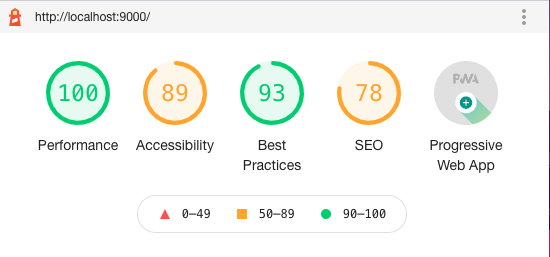

Test - Some of the first things I wanted to play with were colours, of course,  and fonts. 

So I tried to use the typography theme 'fairy gates' (not just because of the name!) but the theme changes alignment of Home and About. And no, I can't cope with misalignment.

Among a million of other things, I need to sort out Lighthouse:

